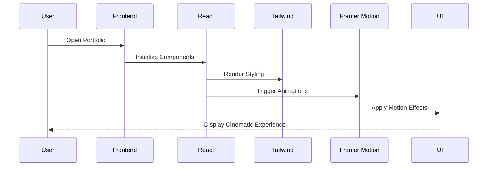
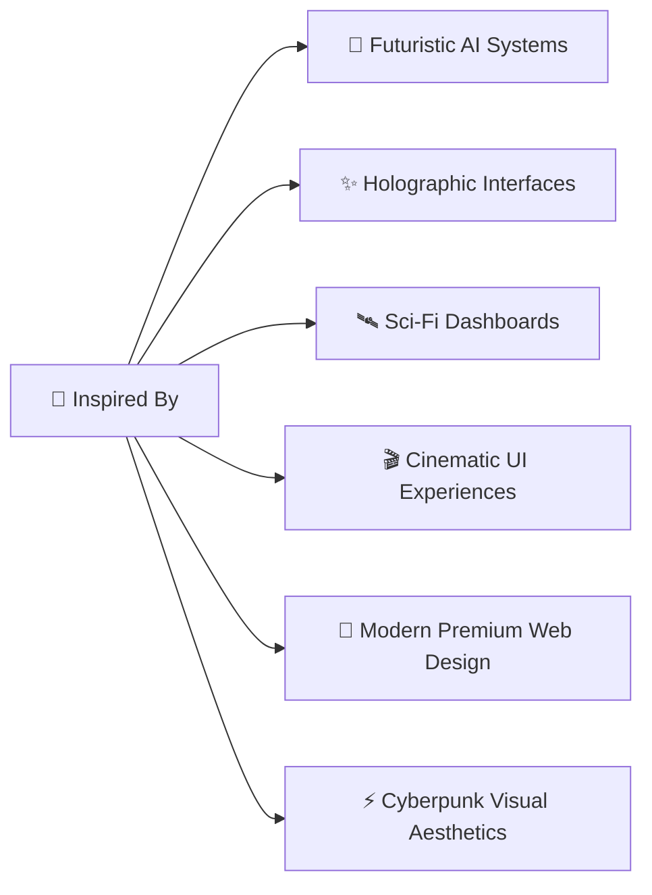

<div align="center">


<pre>
██╗   ██╗██╗███╗   ██╗ █████╗  █████╗ ██╗         ██████╗ 
██║   ██║██║████╗  ██║██╔══██╗██╔══██╗██║         ██╔══██╗
██║   ██║██║██╔██╗ ██║███████║███████║██║         ██████╔╝
╚██╗ ██╔╝██║██║╚██╗██║██╔══██║██╔══██║██║         ██╔══██╗
 ╚████╔╝ ██║██║ ╚████║██║  ██║██║  ██║███████╗    ██║  ██║
  ╚═══╝  ╚═╝╚═╝  ╚═══╝╚═╝  ╚═╝╚═╝  ╚═╝╚══════╝    ╚═╝  ╚═╝
</pre>

<br> 


<br><br>


<br><br>

<a href="https://vinaalr.netlify.app/">
  
</a>

<a href="https://github.com/Dark-Vinaal">
  
</a>

<br><br>

 

</div>

<div align="center">  </div>

## 🌌 Portfolio Website

> A cinematic futuristic portfolio inspired by AI systems, cyberpunk interfaces, holographic dashboards, and modern premium UI experiences.

<div align="center">  </div>

## ⚡ Overview

This portfolio is built to create a premium futuristic experience with:
- smooth cinematic motion
- glowing neon interfaces
- immersive dark UI
- interactive project showcases
- modular architecture
- responsive layouts
- modern frontend technologies

The project reflects:
- 🧠 creativity
- ⚡ engineering
- 🎨 UI experimentation
- 🚀 futuristic web concepts

<div align="center">  </div>

## 🧠 Tech Stack

<div align="center">


</div>

<div align="center">  </div>

## ⚛️ Core Technologies

| Technology | Usage |
|---|---|
| React | Frontend UI System |
| Vite | Lightning-fast Build Tool |
| TypeScript | Static Type Safety |
| Tailwind CSS | Utility-first Styling |
| Framer Motion | Motion & Transitions |
| Lucide React | Modern Icon System |
| React Icons | Skill & Brand Icons |

<div align="center">  </div>

## 🌌 Interface Architecture

```mermaid
graph TD

A[User] --> B[Portfolio System]

B --> C[React Application]
B --> D[Animation Engine]
B --> E[UI Rendering Layer]

C --> F[Hero Section]
C --> G[About Module]
C --> H[Skills Matrix]
C --> I[Projects Interface]
C --> J[Contact Terminal]

D --> K[Framer Motion]
D --> L[3D Hover Effects]
D --> M[Glow Transitions]

E --> N[Tailwind CSS]
E --> O[Responsive Layout]
E --> P[Dark Theme System]
````

<div align="center">  </div>

## 🚀 Core Features

<div align="center">

| ⚡ Feature                 | 🌌 Description                       |
| ------------------------- | ------------------------------------ |
| 🖤 Futuristic UI          | Cyberpunk-inspired premium interface |
| ⚛️ Motion Effects         | Smooth animations & transitions      |
| 📱 Fully Responsive       | Optimized for all devices            |
| 🧠 Modular Structure      | Easily customizable architecture     |
| 🚀 High Performance       | Powered by Vite                      |
| 🌌 Interactive Experience | Modern cinematic interactions        |
| ✨ Hover Systems           | 3D project card effects              |
| 🎨 Dark Aesthetic         | AI dashboard-inspired visuals        |

</div>

<div align="center">  </div>

## 🛰️ Portfolio Sections

### 🏠 Hero System

* Dynamic landing interface
* Animated typography
* CTA interactions
* Cinematic motion

### 👨‍💻 About Module

* Personal introduction
* Developer overview
* Creative profile section

### ⚡ Skills Matrix

* Interactive tech grid
* Animated hover systems
* Modern icon showcase

### 🌌 Projects Interface

* 3D project cards
* Smooth transitions
* Interactive showcases
* Responsive layouts

### 📬 Contact Terminal

* Contact form
* Social integration
* Communication interface

<div align="center">  </div>

## 🎨 UI Philosophy

```txt id="t8r9g2"
Dark Interface
        +
Cyberpunk Aesthetic
        +
Motion Design
        +
Minimal Layout
        +
Glow Systems
        +
Cinematic Experience
        =
PORTFOLIO SYSTEM
```

<div align="center">  </div>

## 🌍 Live Preview

<div align="center">

### 🚀 ACCESS LIVE SYSTEM

<a href="https://vinaalr.netlify.app/">
  
</a>

</div>

<div align="center">  </div>

## 📂 Project Structure

```txt
📦 src/
│
├── 🧩 components/
├── 🌌 sections/
├── 🎨 assets/
├── 📊 data/
├── ⚛️ animations/
├── 🎭 styles/
├── 🪝 hooks/
├── 🛠️ utils/
└── 📄 pages/
```

<div align="center">  </div>

## ⚛️ Rendering Flow



<div align="center">  </div>

## 🌌 Design Inspiration



<div align="center">  </div>

## 🧠 Future Upgrades

* 🌌 Advanced particle systems
* ⚛️ Shader-based animations
* 🛰️ Interactive 3D environments
* 🤖 AI assistant integration
* 📊 Dynamic analytics dashboard
* 🎨 Real-time visual effects
* 🔥 Advanced motion systems

<div align="center">  </div>

## 👨‍🚀 Developer

<div align="center">

# Vinaal R

### Creative Developer • UI Explorer • Futuristic Interface Enthusiast


</div>

<div align="center">  </div>

## 🌐 Connect

<div align="center">

<a href="https://github.com/Dark-Vinaal">
  
</a>
<a href="https://www.linkedin.com/in/vinaal">
  
</a>
<a href="https://vinaalr.netlify.app/">
  
</a>

</div>

<div align="center">


